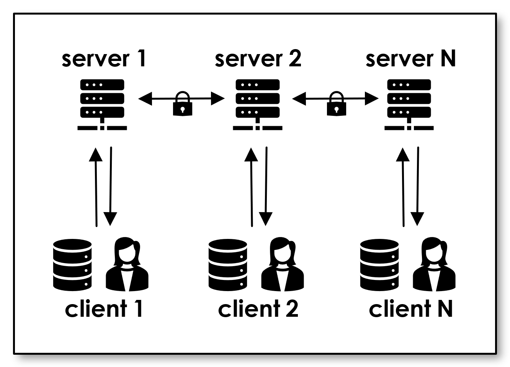
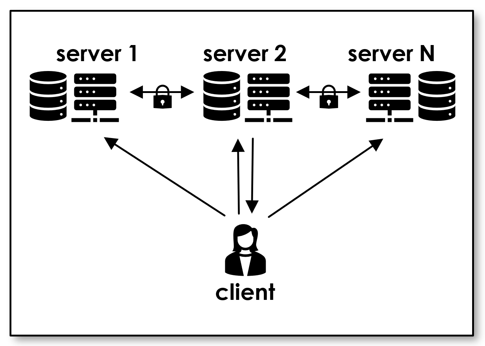
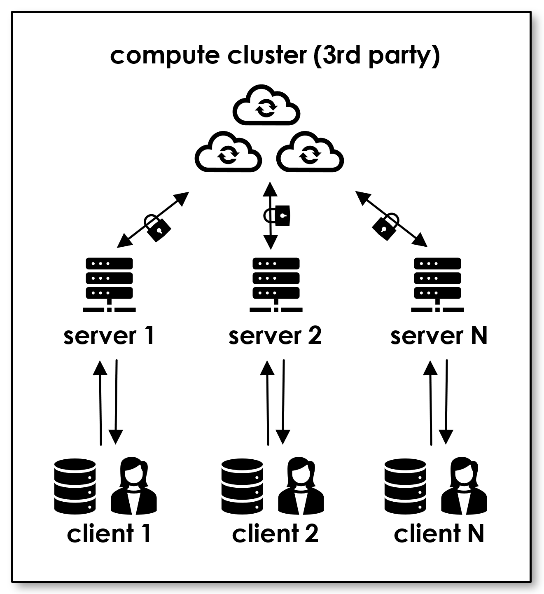
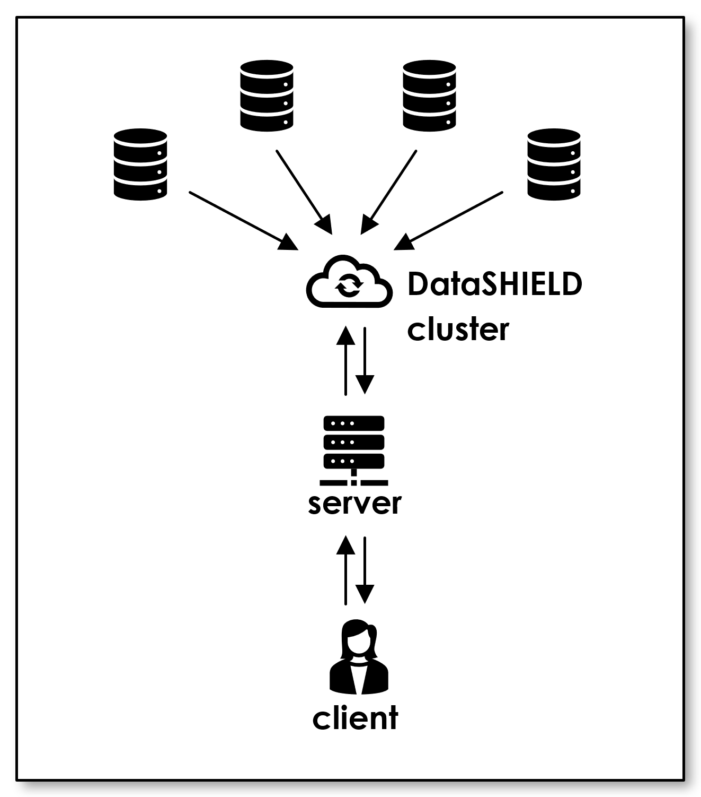

Federated Secure Computing: Technical Whitepaper
================================================

Authors:
Ballhausen, H (LMU Munich)

# Abstract

## Background and Motivation

Privacy-preserving computation (PPC) enables computation on several parties’ proprietary data that cannot be shared openly between participants. The family of technologies includes secure multiparty computation, differential privacy, homomorphic encryption, and others.

In practice, there are often steep barriers to entry. Small and medium enterprises, startups and individuals, research and teaching institutions lack the specific knowledge and resources to implement solutions and deploy and maintain the demanding and complex tech stacks.

Federated Secure Computing is an open-source initiative championed by Ludwig-Maximilians-Universität München (LMU Munich) and funded by Stifterverband. The project aims to provide access to PPC to a larger developer audience without specialist knowledge. 

## Methods

Federated Secure Computing features a client/server architecture. Its main design goal is to render client-side development of business logic as simple as possible.  Server-side cryptography is hidden behind a lean API. Data flow and control flow are both streamlined:

Each data owner operates their own server. This enables clients to send data to their proprietary server in clear without the need to generate cryptographic shares client-side. Alternatively, proprietary data bases may be directly accessed server-side with control flow from the client.

Control flow happens through microservices provided by an Open API 3.0 interface. A lean middleware represents server-side objects to the client and forwards requests to the cryptographic backend. Microservices wrap fine-grained cryptographic instructions into higher level macros to provide simpler and tested routines to non-expert client-side developers.

## Results

A free and open-source implementation is provided at github.com/federatedsecure

The server-side implementation is 100% Python with no tech stack needed beyond a standard webserver such as Connexion or Django (both are provided as stubs). The client-side implementation is just a thin API wrapper, available in several programming languages. A simple multiparty computation (“Simon”) protocol is provided as propaedeutic example of a cryptographic backend. 

## Conclusion

Federated Secure Computing is a free and open-source software (FOSS) initiative funded by Stifterverband and maintained by LMU Munich. The architecture aims to render PPC more accessible and inclusive, as a first steppingstone to build privacy-friendly applications. We hope this whitepaper enables anyone to join the ecosystem, and we are welcoming contributions.

# Background

(... to do ...)

# Methods (Architecture)

## Pain Points and Design Goals

Presently, PPC still has several barriers to entry. Some are one the business side (lacking financial incentives, unproven business models) ore purely historical (lack of visible role models and successful show cases). These are out of the scope. However, many barriers are related to rather technical pain points that render development, deployment, and operation of PPC solutions cumbersome and difficult. These can and should be addressed by the architecture.

The following pain points are recurring topics in the literature, have been encountered in interviews with prospective early adopters, or have been experienced firsthand by the authors. Each has led to the formulation of a specific design goal addressing those concerns:

#### Table 1 – pain points and derived design goals

<table cellspacing="0" cellpadding="0" border="1">
 <thead>
  <tr>
   <td><strong>pain points</strong></td>
   <td><strong>design goals</strong></td>
  </tr>
 </thead>
 <tbody>
  <tr>
   <td colspan="2"><strong>related to capabilities (C)</strong></td>
  </tr>
  <tr>
   <td>front-end and business logic developers rarely have any expert knowledge in PPC</td>
   <td>provide high-level computing routines that hide low-level cryptography protocols <strong>(C1)</strong></td>
  </tr>
  <tr>
   <td>PPC is inaccessible to marginal groups lacking computing and personal resources</td>
   <td>build a minimalistic solution that can be run by a single developer on a Raspberry Pi <strong>(C2)</strong></td>
  </tr>
  <tr>
   <td>PPC is difficult to teach and to experience in the limited time frame of a typical lesson</td>
   <td>provide a propaedeutic solution that works in a school or university teaching setting <strong>(C3)</strong></td>
  </tr>
  <tr>
   <td colspan="2"><strong>related to development (D)</strong></td>
  </tr>
  <tr>
   <td>PPC often appears as the core functionality, so far as to even require to be a main routine</td>
   <td>PPC should be a network-level concern and separated from high-level concerns <strong>(D1)</strong></td>
  </tr>
  <tr>
   <td>introducing PPC functionality to a business logic often requires a complete rework</td>
   <td>enable piecewise introduction of PPC into an existing legacy business logic codebase <strong>(D2)</strong></td>
  </tr>
  <tr>
   <td>PPC frameworks require a specific tech stack and introduce a lot of dependencies</td>
   <td>the client-side and the core of the server-side should be free of any dependencies <strong>(D3)</strong></td>
  </tr>
  <tr>
   <td>coding for any particular PPC framework locks the developer to a specific language</td>
   <td>let client-side developers freely choose their language or keep using the legacy one <strong>(D4)</strong></td>
  </tr>
  <tr>
   <td colspan="2"><strong>related to security concerns (S)</strong></td>
  </tr>
  <tr>
   <td>some PPC frameworks are developed by non-experts in cryptography and are unsafe</td>
   <td>do not reinvent the wheel, make use of existing and proven PPC frameworks <strong>(S1)</strong></td>
  </tr>
  <tr>
   <td>PPC involves sensitive data that should not be visible to the front-end or the outside</td>
   <td>enable topologies with data flow confined to trusted machines on the backend <strong>(S2)</strong></td>
  </tr>
  <tr>
   <td>many PPC use cases involve a third-party researcher who must be able to run analyses</td>
   <td>enable topologies with control flow coming from an external researcher <strong>(S3)</strong></td>
  </tr>
  <tr>
   <td>every PPC calculation requires a complete re-evaluation by data security officers</td>
   <td>separate topology, protocol, and function so they can be assessed independently <strong>(S4)</strong></td>
  </tr>
  <tr>
   <td colspan="2"><strong>related to deployment and operation (O)</strong></td>
  </tr>
  <tr>
   <td>PPC often requires all parties to agree on the exact same tech stack and IT environment</td>
   <td>enable joint computation between parties using different hardware and software <strong>(O1)</strong></td>
  </tr>
  <tr>
   <td>without a lot of experience, it is often unclear which PPC framework is best suited for a task</td>
   <td>frameworks should be replaceable without the need to rewrite the business logic <strong>(O2)</strong></td>
  </tr>
  <tr>
   <td>universal PPC solutions often have enormous overhead in terms of space and processing</td>
   <td>provide “small and fast” solutions that cater to the most often encountered tasks <strong>(O3)</strong></td>
  </tr>
 </tbody>
</table>

At its highest level, the architecture is dictated by a twofold separation:

* Business logic needs to be disentangled from cryptography protocols (separation of concerns, dependency inversion)
*	Data flows of different data owners need to be separated from one another until they hit the underlying cryptography layer (privacy)

The first point is conveniently solved by a client/server architecture. Providing server-side PPC protocols through microservices and a web API to the client-side business logic addresses several of the above design goals.

However, if clients are to be entirely free of any cryptography concerns, they cannot send cryptographic shares to the server, but need to be able to send raw data in the clear. This is also true because the client should be agnostic to which particular PPC protocol is run by the server, as different protocols require quite different generation of shares.

Favoring minimalistic lean clients and simplicity of the client-side over other considerations, we thus make the uncommon decision that every data owner runs their own server. In PPC lingo, we have as many compute nodes as there are input/data nodes, and they might coincide.
The resulting and remaining decisions are:

#### Table 2 – design decisions and their rationale

<table cellspacing="0" cellpadding="0" border="1">
 <thead>
  <tr>
   <td><strong>decision</strong></td>
   <td><strong>rationale and addressed design goals</strong></td>
  </tr>
 </thead>
 <tbody>
  <tr>
   <td><strong>client-server</strong>architecture</td>
   <td>
    <ul>
     <li>offload computationally expensive cryptography to the server <strong>(D1)</strong></li>
     <li>separate business logic concerns (client-side) from cryptography concerns (server-side)<strong>(C1, D1, O2)</strong></td></li>
    </ul>
  </tr>
  <tr>
   <td>one <strong>dedicated server</strong> per client</td>
   <td>
    <ul>
     <li>allows clients to remain lightweight and generalist API wrappers without specific encryption logic <strong>(D3)</strong></li>
     <li>servers can be trusted by their own client/data owner <strong>(S2, S3)</strong></li>
     <li>for less attack surface, it is possible to keep data entirely server-side with only control flow coming from the client <strong>(S2, S3)</strong></li>
     <li>easy to analyze and straightforward to secure <strong>(S4, S2)</strong></li>
     <li>easy to explain and understand in a propaedeutic setting <strong>(C3)</strong></li>
  </tr>
  <tr>
   <td>solution should be a <strong>middleware</strong></td>
   <td>
    <ul>
     <li>encapsulate low-level cryptographic scripts and provide them to the client as high-level macros <strong>(C1, D1)</strong></li>
     <li>provide the same macros for different PPC backends <strong>(O2, S4)</strong></li>
     <li>hosting one or several established PPC frameworks <strong>(S1)</strong></li>
     </li>
    </ul>
   </td>
  </tr>
  <tr>
   <td>provide <strong>microservices</strong> ...</td>
   <td>
    <ul>
     <li>rebuild business logic piecewise in a privacy friendly fashion <strong>(D2)</strong></li>
     <li>provide highly optimized microservices for specific business problems instead of slow universal monoliths <strong>(O3, C2)</strong></li>
  </tr>
  <tr>
   <td>... through a <strong>RESTful API</strong></td>
   <td>
    <ul>
     <li>easy to provide API wrapper in any programming language <strong>(D4)</strong></li>
     <li>client remains free of any PPC-specific dependencies <strong>(D3)</strong></li>
    </ul>
   </td>
  </tr>
  <tr>
   <td>represent <strong>server-side objects</strong> 1:1 client-side</td>
   <td>
    <ul>
     <li>make client-side code easy to read and write <strong>(D1, C1, C3)</strong></li>
     <li>allow the client to remain lightweight yet powerful <strong>(D3, C2, C3)</strong></li>
     <li>allow server-side-only data flow <strong>(S2, S3, S4)</strong></li>
    </ul>
   </td>
  </tr>
  <tr>
   <td>implement server middleware in <strong>Python </strong> (optional)</td>
   <td>
    <ul>
     <li>core middleware can be implemented in pure Python without any additional dependencies except for a webserver <strong>(D3)</strong></li>
     <li>Python is available on most any platform <strong>(O1, C2)</strong></li>
     <li>Python is popular in propaedeutic settings and data science <strong>(C3)</strong></li>
    </ul>
   </td>
  </tr>
 </tbody>
</table>

## Client-Server Topologies

While the decision to have exactly one server per data owner seems to be quite strong, there really is no restriction on the actual topology of the PPC protocols employed in the backend.

In PPC lingo, there are <strong>data nodes</strong> (providing input data), <strong>compute nodes</strong> (running the protocols), and <strong>researcher nodes</strong> (providing control flow and receiving results). Here, we have <strong>server nodes</strong> and <strong>client nodes</strong> which may or may not coincide with data, compute, and/or researcher nodes.

### Example 1: clients act as data and researcher nodes, servers act as compute nodes

This topology is suitable when there are several equal and simultaneously active researchers in a symmetric peer-to-peer network.

#### Figure 1


Clients send unencrypted input data and control flow to their respective server. Servers host the PPC protocol and thus act as compute nodes. They break the input data into cryptographic shares and inject it into the protocol. They execute the protocol on encrypted shares and send the result back to their clients.

The propaedeutic protocol **SIMON** (**SI**mple **M**ultiparty computati**ON**) uses this topology.

### Example 2: servers act as data and compute nodes, single client as researcher node

The difference to Example 1 is that data is hosted on the server, not on the client. This is a more likely case in institutions where data is not supposed to be seen even by their own clients and researchers.

#### Figure 2



In this case, there is no need for more than one researcher (of course, having one researcher per server is still perfectly an option). The single researcher may send control flow to all servers (rendering synchronization trivial) and receive only the result of the computation (but has no access to input data on the servers).

Using server-side object representation, it is possible to write wrappers for server-side data base handles and access them through the client. Care must be taken in this case to properly secure the API, in particular by object level authorization.

This topology is suitable if there is a privileged researcher and a number of independent contributors. For example, a university hospital researching the data of teaching hospitals; a government agency using data of regional bodies; a parent company analyzing subsidiaries; an industry association providing benchmarks to their member companies; etc. 

### Example 3: servers run middleware only, additional compute nodes in the backend

Some PPC protocols might require a certain compute cluster of their own. For example, some SMPC protocols use three independent compute nodes, irrespective of the number of data nodes.

#### Figure 3



In this case, the role of the Federated Secure Computing servers is “only” to act as a gateway hosting a translatory middleware.

They middleware receives input data and translates it into cryptographic shares according to the protocol of the compute cluster; the middleware receives control flow from the client and accordingly instructs the compute cluster.

This topology is useful if one wants to combine the client-side simplicity of Federated Secure Computing with a more mature and complete solution to run the actual computations on the backend.

For example, a [Carbyne Stack](https://carbynestack.io) compute cluster would be a useful backend.

### Example 4: DataSHIELD

[DataSHIELD](https://www.datashield.org) is a popular PPC solution in academic and data science settings. It features a central compute node that receives aggregated data from data nodes, aggregates it further, and forwards the summary statistics to the researcher.

If one wants to capsulate the DataSHIELD server behind a Federated Secure Computing middleware, the topology will look like this figure:

#### Figure 4



In a way, this is a combination of Example 2 (a single researcher) and Example 3 (pure middleware functionality of Federated Secure Computing).

It might be useful if one wants to use client-side languages other than R to develop scripts; or it might be convenient to include DataSHIELD for its statistical power to process e.g. metadata of data that is analyzed in full by other protocols such as secure multiparty computation.

## Client-Side Stack

### Representation of server-side objects

Our design goal is to render client-side business-logic development as simple as possible. We do not want any specific dependencies client-side, and we would like to go through the API as transparent as possible. Hence, we would like to be able to write client-side code like this:

#### Code Listing 1 – Example of how client-side code should interact with server-side objects

```python
import federatedsecure.client

# connect to the server, return API handle
api = federatedsecure.client.connect(“https://my.server”)

# find a microservice that matches some requirements
microservice = api.create(functionality=“can do some stuff”})

# connect to some specific server-side database
database = api.create(connector=“myconnector”, version=“1.2.3”)

# fetch input data
data = database.get_handle().query(row=2, column=5)

# do some server-side computation
result = microservice.compute(data)

# download and output the result
print(api.download(result))
```

There are two functions that translate between server-side and client-side:

`api.create` returns a handle to a top-level server-side object, typically a microservice. It is given some arguments describing the desired microservice. 

`api.download` serializes the server-side data belonging to some handle and returns it to the client.

This means that all the other variables in above pseudocode (`microservice`, `database`, `data`, and `result`) are simply handles to server-side objects. The client can access them through the API and trigger server-side behavior without any client-side dependencies. We achieve this by using a wrapper class called `Representation`.

As its name implies, it represents server-side objects. It stores a pointer to the API (so it can trigger requests to the API) and a unique identifier (UUID) of the server-side object. Access to member variables and functions can then be reflected on the API by passing the UUID.

In Python, this is particularly straightforward:

#### Code Listing 2 – class Representation (simplified, see actual code!)

```python
class Representation:

  def __init__(self, api, uuid):
    self.api = api
    self.uuid = uuid

    def __getattr__(self, member_name):
      return self.api.attribute(self.uuid, member_name)

    def __call__(self, *args, **kwargs):
        return self.api.call(self.uuid, *args, **kwargs)
```

For example, `database.get_handle().query(row=2, column=5)` in fact creates four (!) representations: 1) of the member function `get_handle`, 2) of the result of invoking that member function without arguments, 3) of that result’s member function `query`, and 4) of the result of `query` with some arguments.

Note that such nice syntactic sugar is not available in all programming languages. For example, in R the same code would read:

#### Code Listing 3 – In some languages, client code will be more verbose than in Python

```r
source (“.../federatedsecure/client.r”)

# connect to the server, return API handle
api <- Api(“https://my.server”)

# find a microservice that matches some requirements
microservice <- api$create(kwargs=list(
                  functionality=“can do some stuff”))

# connect to some specific server-side database
database <- api$create(kwargs=list(
              connector=“myconnector”, version=“1.2.3”))

# fetch input data
func_handle <- database$attribute(“get_handle”)
handle <- func_handle$call()
func_query <- handle$attribute(“query”)
data <- func_query$call(list(row=2, column=5))

# do some server-side computation
func_compute <- microservice$attribute(“compute”)
result <- func_compute$call(list(data=data))

# download and output the result
print(api$download(result))
```

### API Wrapper

By using `Representation` the entire API traffic can be routed through very few RESTful endpoints:

<table>
 <thead>
  <tr>
   <td>verb</td>
   <td>endpoint</td>
   <td>server-side effect and response</td>
  </tr>
 </thead>
 <tbody>
  <tr>
   <td>GET</td>
   <td>/representations</td>
   <td>
    <ul>
     <li>list of top-level microservices
    </ul>
   </td>
  </tr>
  <tr>
   <td>POST</td>
   <td>/representations</td>
   <td>
    <ul>
     <li>finds matching top-level microservice
     <li>returns uuid representing the microservice
    </ul>
   </td>
 </tr>
  <tr>
   <td>PUT</td>
   <td>/representations</td>
   <td>
    <ul>
     <li>upload data and stores it server-side
     <li>returns uuid representing the data
    </ul>
   </td>
 </tr>
  <tr>
   <td>PATCH</td>
   <td>/representation/{uuid}</td>
   <td>
    <ul>
     <li>calls server-side function represented by uuid
     <li>stores the return value server-side
     <li>returns uuid representing the return value
    </ul>
   </td>
 </tr>
  <tr>
   <td>GET</td>
   <td>/representation/{uuid}/{attr}</td>
   <td>
    <ul>
     <li>gets attribute (e.g. child variable, member function) of object represented by uuid
     <li>stores the pointer server-side
     <li>returns uuid representing the attribute
    </ul>
   </td>
 </tr>
  <tr>
   <td>GET</td>
   <td>/representation/{uuid}</td>
   <td>
    <ul>
     <li>serializes the object represented by uuid
     <li>returns the serialized data
    </ul>
   </td>
 </tr>
  <tr>
   <td>DELETE</td>
   <td>/representation/{uuid}</td>
   <td>
    <ul>
     <li>deletes the object represented by uuid
    </ul>
   </td>
  </tr>
 </tbody>
</table>

In these terms, it is easy to implement `api.create`, `api.download`, `api.call`, and `api.download` as used in the main routine and in  Representation above:

```python
class Api:

    def __init__(self, url):
        self.http = HttpInterface(url)

    def list(self):
        return self.http.GET('representations')

    def create(self, *args, **kwargs):
        response = self.http.POST('representations',
                   body={'args': args, 'kwargs': kwargs})
        return Representation(self, response['uuid'])

    def upload(self, *args, **kwargs):
        response = self.http.PUT('representations',
                   body={'args': args, 'kwargs': kwargs})
        return Representation(self, response['uuid'])

    def call(self, uuid, *args, **kwargs):
        response = self.http.PATCH('representation', uuid,
                   body={'args': args, 'kwargs': kwargs})
        return Representation(self, response['uuid'])

    def attribute(self, uuid, attr):
        response = self.http.GET('representation', uuid, attr)
        return Representation(self, response['uuid'])

    def download(self, representation):
        response = self.http.GET('representation',
                   representation.uuid)
        return response['object']

    def release(self, uuid):
        self.http.DELETE('representation', uuid)
        return None
```

### Client design considerations

**Programming language** - At the time of writing, there are API wrappers in Python, R, and JavaScript. As the client is very thin and only contains the classes Api and Representation and a HTTP interface, it is easy to develop API wrappers in other languages. And in principle, curl would suffice.

**Thin client** – One should keep the client as thin as possible. We want client-side developers to be free in their choice of language, so any functionality that we introduce in one language’s API wrapper we would have to introduce in each. Also, we want the client to be small (read: kilobytes) so it can be used in IoT settings.

**Macros should be server-side** – The last point implies that any macro functionality should not be written client-side. For example, if you want to combine several steps like connecting to a database, getting a handle, reading data and storing it into a single line of client-code, then you should write a small server-side extension for that. This way, the functionality will be available in all clients, and this eliminated several potentially slow and payload-heavy API calls. 

**Securing the API** – This is mainly a server-side concern, but one would probably have to account for authentication and authorization on the client, too. Federated Secure Computing is designed for propaedeutic settings, but if it were used in production, this would have to be adapted to the organization’s specific security implementation.

**Full RPC framework** – Our implementation above is minimalistic and propaedeutic. It is a lean way to interact with server-side objects in a generic way. In a production setting, you might want to employ a more complete and stable framework for remote procedure calls.

## Server-Side Stack

### Registry, Discovery, and Bus

The core middleware consists at the minimum of a registry of server-side objects, a bus to access them, and a discovery mechanism to register top-level objects.

The **registry** holds pairs of top-level microservices and their description. At the minimum, it offers functionality to register another microservice and its description; list all registered microservices; or fetch a specific object that matches the requested description. This description is the abstraction that both the registry and the microservice depend upon, such that their implementation is decoupled (dependency-inversion-principle).

The **discovery mechanism** scans for available microservices at startup and exposes the registry to them so that they may register themselves. In this way, one can add new microservices without modifying the server (open-closed-principle).

The **bus** exposes server-side objects to the API and to one another. These objects may be microservices from the original registry, but also any number of classes and instances that are created, modified, and discarded during runtime.

# Results

(... to do ...)

# Conclusion

(... to do ...)
