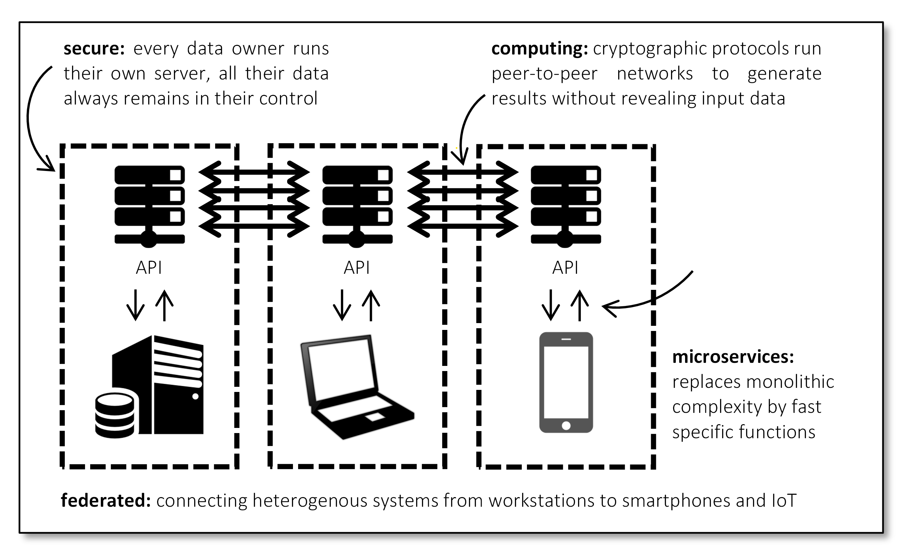
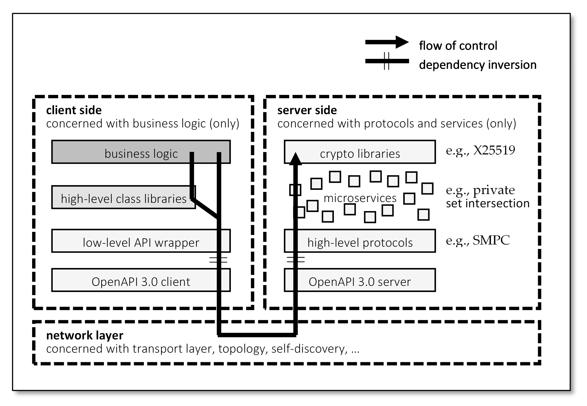
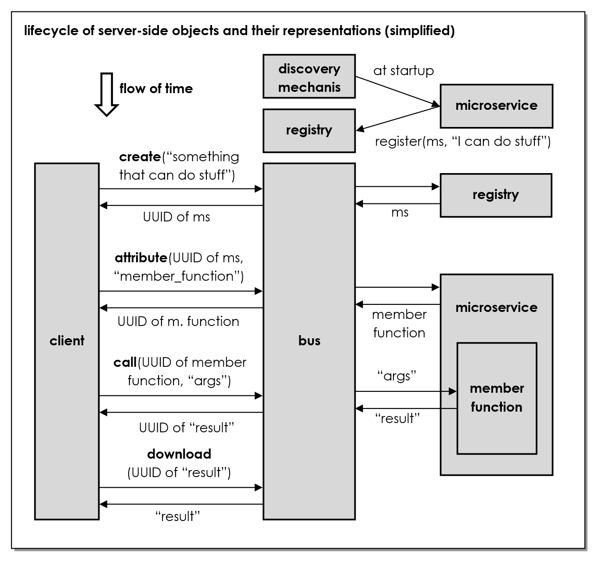
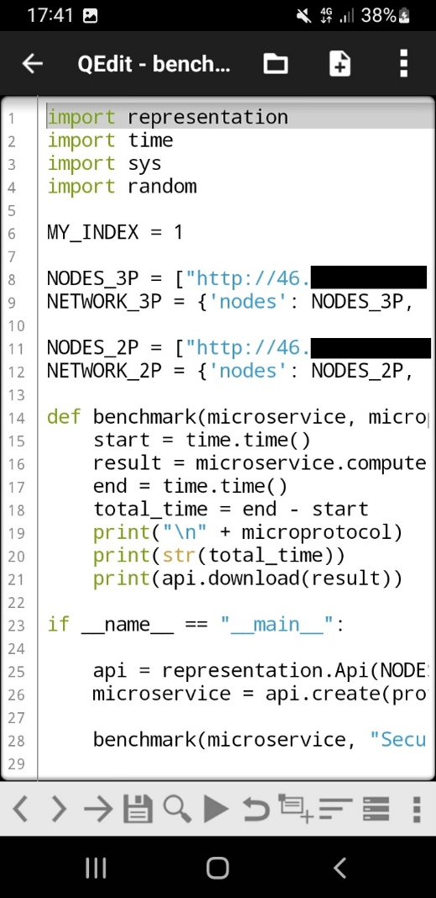
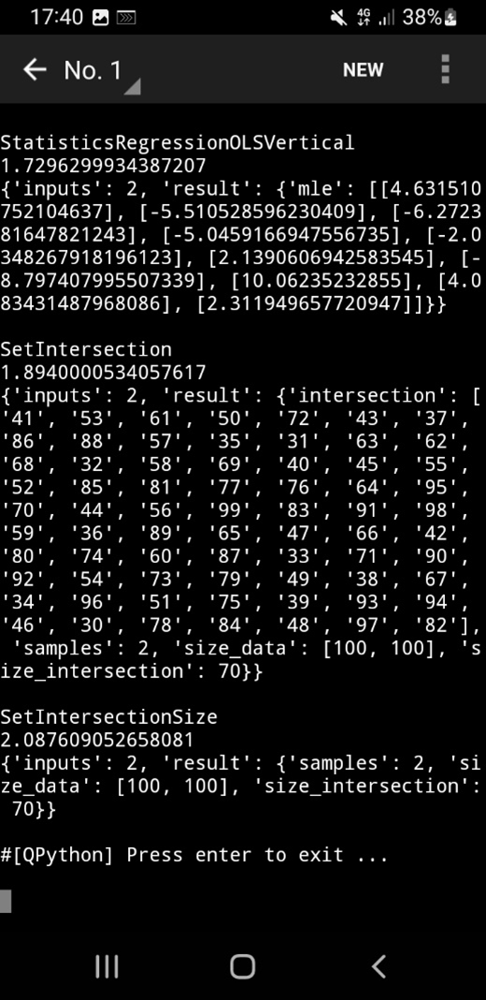

Federated Secure Computing
==========================

(C) 2023 by the authors. Licensee MDPI, Basel, Switzerland. This article is an open access article distributed under the terms and conditions of the [Creative Commons Attribution (CC BY) license](https://creativecommons.org/licenses/by/4.0/). Please cite as:

    Ballhausen H, Hinske LC. Federated Secure Computing. Informatics. 2023; 10(4):83. https://doi.org/10.3390/informatics10040083

by Hendrik Ballhausen (1,*) and Ludwig Christian Hinske (2,3)

(1) Medical Faculty, Ludwig-Maximilians-Universität München, Geschwister-Scholl-Platz 1, 80539 Munich, Germany

(2) Institute for Digital Medicine, University Hospital Augsburg, Stenglinstrasse 2, 86156 Augsburg, Germany

(3) Department of Anaesthesiology, LMU University Hospital, LMU Munich, Marchioninistrasse 15, 81377 Munich, Germany

(*) Author to whom correspondence should be addressed. 

Informatics **2023**, 10(4), 83; https://doi.org/10.3390/informatics10040083

**Submission received: 24 August 2023 / Revised: 22 October 2023 / Accepted: 23 October 2023 / Published: 31 October 2023**


# Abstract

Privacy-preserving computation (PPC) enables encrypted computation of private data. While advantageous in theory, the complex technology has steep barriers to entry in practice. Here, we derive design goals and principles for a middleware that encapsulates the demanding cryptography server side and provides a simple-to-use interface to client-side application developers. The resulting architecture, “Federated Secure Computing”, offloads computing-intensive tasks to the server and separates concerns of cryptography and business logic. It provides microservices through an Open API 3.0 definition and hosts multiple protocols through self-discovered plugins. It requires only minimal DevSecOps capabilities and is straightforward and secure. Finally, it is small enough to work in the internet of things (IoT) and in propaedeutic settings on consumer hardware. We provide benchmarks for calculations with a secure multiparty computation (SMPC) protocol, both for vertically and horizontally partitioned data. Runtimes are in the range of seconds on both dedicated workstations and IoT devices such as Raspberry Pi or smartphones. A reference implementation is available as free and open source software under the MIT license.

**Keywords: privacy-preserving computing; cloud computing; federated computing; cryptography; secure multiparty computation; propaedeutic framework; Python; free and open source software**


# 1. Introduction

Data has been called the “new oil” that fuels the digital future economy. Society and science need data to make informed decisions, and such information becomes more reliable when it builds upon independent data sources. Enterprises and consumers begin to understand the value of their data assets, and again, such data become more valuable when they are pooled from inaccessible silos into large comprehensive data lakes.

On the other hand, there is a lot of friction in sharing data openly. Companies are afraid to reveal trade secrets to their competitors. Research and development agencies closely guard the results of their work. Consumers and citizens are concerned about privacy and are wary of their data being potentially used to their disadvantage. Data protection and data security are ubiquitous, and informational self-determination has practically become a basic human right.

As a consequence, while 84% of companies believe analytics will improve their competitive position somewhat or significantly [1], and 75% of companies would be willing to share their data [2], only 39% of European companies claim to share data with other companies [3]. Similarly, 92% of internet users are concerned about privacy [4].

In other words, traditionally, there is a tradeoff between the value of data sharing and the need for privacy and data protection. Public domain data and open data have the highest societal and public economy benefits but require participants to relinquish their rights to their data and do not offer much in terms of ex-post control after consent. The middle ground is data sharing and collaboration, subject to licenses and contracts. Due to the ephemeral nature of data, these are often difficult to control and enforce. Finally, data may be privately owned with restricted and limited access by other parties.

There have always been attempts to create frameworks for data sharing that would provide more benefits with fewer downsides. For example, a classic analog example of a “trusted third party” would be the business consultant who confidentially learns the trade secrets of a pool of companies and redistributes the information as sanitized benchmarks and best practices among them.

In the information age, “federated computing” aims to integrate data from heterogeneous sources. Results are computed by the involved parties in a distributed fashion. In particular, privacy-preserving computation (PPC) aims to avoid open data sharing and safeguard the privacy of data subjects. Some of the more prominent examples include the following.

Secure multiparty computation (SMPC) [5,6] locally encrypts input data as cryptographic shares and then performs joint computation on those shares in a peer-to-peer network to derive a result that then becomes known to all involved parties. SMPC is often seen as a gold standard, potentially providing mathematically proven security, even in anonymous, trustless settings with some malicious parties that may seek to deviate from the protocol to discover the other parties’ secret inputs.

Fully homomorphic encryption (FHE) [7,8] locally encrypts input data before sending them to some public cloud. The cloud then performs computation on encrypted data only. While simple and powerful, only very few algorithms actually work on encrypted data.

Differential Privacy (DP) [9,10] seeks to limit access to some databases by keeping track of some “privacy budget”. In particular, researchers are limited in what they may learn about individual data points in the database. This is useful for scientific computation, e.g., on medical databases that seek to derive some aggregate statistics.

For an overview of related technologies, see [11]. To some degree, these technologies all share a common problem. Their power to reconcile data sharing with privacy comes at the cost of increased computational overhead and operational complexity. For example, in the case of SMPC, most frameworks aim to provide a monolithic yet universal solution, replacing basic arithmetic operations with exponentially growing garbled or arithmetic circuits [12,13] or costly asymmetric encryption [14,15,16].

There are only a few turn-key solutions commercially available, e.g., Sharemind [17]. Available open source frameworks, on the other hand, are rarely industry-grade. They rely on complex dependencies and are built on exotic tech stacks that are cumbersome to develop, operate, and secure. Few are simple to use and explicitly designed to work in propaedeutic settings, e.g., EasySMPC [18].

Presently, PPC still has several barriers to entry. Some are on the business side (lacking financial incentives and unproven business models) or are purely historical (lack of visible role models and successful showcases). These are out of the scope. However, many barriers are related to technical pain points that render the development, deployment, and operation of PPC solutions cumbersome and difficult. In particular, potential users and researchers note the computational overhead (often prohibitive in the case of monolithic universal solutions), exotic tech stacks and dependencies, the lack of cryptography skills of their developers, and the lack of pretext and understanding by their data protection officers. These can and should be addressed by the architecture.

In this work, we present an architecture that alleviates several of the perceived “pain points” and provides a simple yet effective framework to employ different PPC technologies. The goal is to separate the complexity of cryptographic protocols from business logic concerns. The minimalistic solution should be useable by small teams without a background in cryptography. Multiple topologies between data owners, processing nodes, and data consumers should be feasible. Developers should not be forced to use any particular language or libraries. Data flow should be transparent and straightforward to secure. Finally, the solution should be lightweight enough to work in IoT settings and scale to potentially large networks.


# 2. Methods

## 2.1. Pain Points and Design Goals

The following pain points are recurring topics in the literature, have been encountered in interviews with prospective early adopters, or have been experienced firsthand by the authors. Each has led to the formulation of a specific design goal addressing those concerns (see Table 1).

#### Table 1. Pain points and derived design goals.

<table cellspacing="0" cellpadding="0" border="1">
 <thead>
  <tr>
   <td><strong>Pain Points</strong></td>
   <td><strong>Design Goals</strong></td>
  </tr>
 </thead>
 <tbody>
  <tr>
   <td colspan="2"><strong>related to capabilities (C)</strong></td>
  </tr>
  <tr>
   <td>front-end and business logic developers rarely have any expert knowledge of PPC</td>
   <td>provide high-level computing routines that hide low-level cryptography protocols <strong>(C1)</strong></td>
  </tr>
  <tr>
   <td>PPC is inaccessible to marginal groups lacking computing and personal resources</td>
   <td>build a minimalistic solution that can be run by a single developer on a Raspberry Pi [19] <strong>(C2)</strong></td>
  </tr>
  <tr>
   <td>PPC is difficult to teach and experience in the limited time frame of a typical lesson</td>
   <td>provide a propaedeutic solution that works in a school or university teaching setting <strong>(C3)</strong></td>
  </tr>
  <tr>
   <td colspan="2"><strong>related to development (D)</strong></td>
  </tr>
  <tr>
   <td>PPC often appears as the core functionality, so far as to even require to be a main routine</td>
   <td>PPC should be a network-level concern, separated from high-level concerns <strong>(D1)</strong></td>
  </tr>
  <tr>
   <td>introducing PPC functionality to a business logic often requires a complete rework</td>
   <td>enable piecewise introduction of PPC into an existing legacy business logic codebase <strong>(D2)</strong></td>
  </tr>
  <tr>
   <td>PPC frameworks require a specific tech stack and introduce a lot of dependencies</td>
   <td>client side and the core of the server side should be free of any dependencies <strong>(D3)</strong></td>
  </tr>
  <tr>
   <td>coding for any particular PPC framework locks the developer to a specific language</td>
   <td>let client-side developers freely choose their language or keep the legacy one <strong>(D4)</strong></td>
  </tr>
  <tr>
   <td colspan="2"><strong>related to security concerns (S)</strong></td>
  </tr>
  <tr>
   <td>some PPC frameworks are developed by non-experts in cryptography and are unsafe</td>
   <td>do not reinvent the wheel; make use of existing and proven PPC frameworks <strong>(S1)</strong></td>
  </tr>
  <tr>
   <td>PPC involves sensitive data that should not be visible to the front end or the outside</td>
   <td>enable topologies with data flow confined to trusted machines on the backend <strong>(S2)</strong></td>
  </tr>
  <tr>
   <td>many PPC use cases involve a third-party researcher who must be able to run analyses</td>
   <td>enable topologies with control flow coming from an external researcher <strong>(S3)</strong></td>
  </tr>
  <tr>
   <td>every PPC calculation requires a complete re-evaluation by data security officers</td>
   <td>separate topology, protocol, and function so they can be assessed independently <strong>(S4)</strong></td>
  </tr>
  <tr>
   <td colspan="2"><strong>related to deployment and operation (O)</strong></td>
  </tr>
  <tr>
   <td>PPC often requires all parties to agree on the exact same tech stack and IT environment</td>
   <td>enable joint computation between parties using different hardware or software <strong>(O1)</strong></td>
  </tr>
  <tr>
   <td>without a lot of experience, it is often unclear which PPC framework is best suited for a task</td>
   <td>frameworks should be replaceable without the need to rewrite business logic <strong>(O2)</strong></td>
  </tr>
  <tr>
   <td>universal PPC solutions often have enormous overhead in terms of space and processing</td>
   <td>provide “small and fast” solutions that cater to the most often encountered tasks <strong>(O3)</strong></td>
  </tr>
 </tbody>
</table>

## 2.2. Resulting Architecture

At its highest level, the architecture is dictated by a twofold separation: Business logic needs to be disentangled from cryptography protocols (separation of concerns, dependency inversion). And data flows of different data owners need to be separated from one another until they hit the underlying cryptography layer (privacy).

The first point is conveniently solved by a client/server architecture. Providing server-side PPC protocols through microservices and a web API to the client-side business logic addresses several of the above design goals.

However, if clients are to be entirely free of any cryptography concerns, they cannot send cryptographic shares to the server but need to be able to send raw data in the clear. This is also true because the client should be agnostic as to which particular PPC protocol is run by the server, as different protocols require quite different generations of shares.

Favoring minimalistic lean clients and simplicity of the client side over other considerations, we thus make the uncommon decision that every data owner runs their own server. In PPC lingo, we have as many compute nodes as there are input/data nodes, and they might coincide.
The resulting design decisions are listed in Table 2.

#### Table 2. Design decisions and their rationale.

<table cellspacing="0" cellpadding="0" border="1">
 <thead>
  <tr>
   <td><strong>Design Decision</strong></td>
   <td><strong>Rationale and Addressed Design Goals</strong></td>
  </tr>
 </thead>
 <tbody>
  <tr>
   <td>client–server architecture</td>
   <td>
    <ul>
     <li>offload computationally expensive cryptography to the server <strong>(D1)</strong></li>
     <li>separate business logic concerns (client-side) from cryptography concerns (server side) <strong>(C1, D1, O2)</strong></td></li>
    </ul>
  </tr>
  <tr>
   <td>one dedicated server per client</td>
   <td>
    <ul>
     <li>allows clients to remain lightweight and generalist API wrappers without specific encryption logic <strong>(D3)</strong></li>
     <li>servers can be trusted by their own client/data owner <strong>(S2, S3)</strong></li>
     <li>for less attack surface, it is possible to keep data entirely server side with only control flow coming from the client <strong>(S2, S3)</strong></li>
     <li>easy to analyze and straightforward to secure <strong>(S4, S2)</strong></li>
     <li>easy to explain and understand in a propaedeutic setting <strong>(C3)</strong></li>
  </tr>
  <tr>
   <td>solution should be a middleware</td>
   <td>
    <ul>
     <li>encapsulate low-level cryptographic scripts and provide them to the client as high-level macros <strong>(C1, D1)</strong></li>
     <li>provide the same macros for different PPC backends <strong>(O2, S4)</strong></li>
     <li>hosting one or several established PPC frameworks <strong>(S1)</strong></li>
     </li>
    </ul>
   </td>
  </tr>
  <tr>
   <td>provide microservices</td>
   <td>
    <ul>
     <li>rebuild business logic piecewise in a privacy-friendly fashion <strong>(D2)</strong></li>
     <li>provide highly optimized microservices for specific business problems instead of slow universal monoliths <strong>(O3, C2)</strong></li>
  </tr>
  <tr>
   <td>provide RESTful API</td>
   <td>
    <ul>
     <li>easy to provide API wrapper in any programming language <strong>(D4)</strong></li>
     <li>client remains free of any PPC-specific dependencies <strong>(D3)</strong></li>
    </ul>
   </td>
  </tr>
  <tr>
   <td>represent server-side objects 1:1 client-side</td>
   <td>
    <ul>
     <li>make client-side code easy to read and write <strong>(D1, C1, C3)</strong></li>
     <li>allow the client to remain lightweight yet powerful <strong>(D3, C2, C3)</strong></li>
     <li>allow server-side-only data flow <strong>(S2, S3, S4)</strong></li>
    </ul>
   </td>
  </tr>
  <tr>
   <td>implement server middleware in Python (optional)</td>
   <td>
    <ul>
     <li>core middleware can be implemented in pure Python without any additional dependencies except for a webserver <strong>(D3)</strong></li>
     <li>Python is available on most any platform <strong>(O1, C2)</strong></li>
     <li>Python is popular in propaedeutic settings and data science <strong>(C3)</strong></li>
    </ul>
   </td>
  </tr>
 </tbody>
</table>


## 2.3. Overall Concept of Federated Secure Computing

Federated Secure Computing connects heterogeneous systems (federation) through privacy-preserving computing protocols (secure computing), Figure 1.

#### Figure 1. Federated Secure Computing. 


It achieves this as a middleware between client-side business logic and server-side cryptography backends. It encapsulates the secure computing functionality through specific microservices and exposes them to the clients through an easy-to-use API, Figure 2.

#### Figure 2. Flow of control, separation of concerns between client and server side, and API/microservice architecture. 



## 2.4. Client–Server Topologies

While the decision to have exactly one server per data owner seems to be quite strong, there really is no restriction on the actual topology of the PPC protocols employed in the backend.

In PPC lingo, there are data nodes (providing input data), compute nodes (running the protocols), and researcher nodes (providing control flow and receiving results). Here, we have server nodes and client nodes, which may or may not coincide with data, compute, and/or researcher nodes.

### 2.4.1. Example 1: Clients Act as Data and Researcher Nodes and Servers Act as Compute nodes

This topology is suitable when there are several equal and simultaneously active researchers in a symmetric peer-to-peer network.

Clients send unencrypted input data and control flow to their respective servers. Servers host the PPC protocol and thus act as compute nodes. They break the input data into cryptographic shares and inject it into the protocol. They execute the protocol on encrypted shares and send the result back to their clients, Figure 3.

#### Figure 3. Symmetric peer-to-peer topology with one client (researcher) per server. 


The propaedeutic protocol Simon (SImple Multiparty computatiON) uses this topology and is provided with the reference implementation as a working example.

### 2.4.2. Example 2: Servers Act as Data and Compute Nodes, and a Single Client Acts as Researcher Node

The difference to Example 1 is that data are hosted on the server, not on the client. This is a more likely case in institutions where data are not supposed to be seen even by their own clients and researchers.

In this case, there is no need for more than one researcher (of course, having one researcher per server is still a perfectly viable option). The single researcher may send control flow to all servers (rendering synchronization trivial) and receive only the result of the computation (but has no access to input data on the servers), Figure 4.

#### Figure 4. Topology with a single central client (researcher). 


Using server-side object representation, it is possible to write wrappers for server-side database handles and access them through the client. In this case, care must be taken to properly secure the API, in particular by object-level authorization.

This topology is suitable if there is a privileged researcher and a number of independent contributors. For example, a university hospital researching the data of teaching hospitals; a government agency using data of regional bodies; a parent company analyzing subsidiaries; an industry association providing benchmarks to their member companies; etc.

### 2.4.3. Example 3: Servers Run Middleware Only, and Additional Compute Nodes Are in the Backend

Some PPC protocols might require a certain compute cluster of their own. For example, some SMPC protocols use three independent compute nodes, irrespective of the number of data nodes. In this case, the role of the Federated Secure Computing servers is “only” to act as a gateway hosting a translatory middleware, Figure 5.

#### Figure 5. Topology where servers run middleware only and compute cloud as backend. 


The middleware receives input data and translates them into cryptographic shares according to the protocol of the compute cluster; the middleware receives control flow from the client and accordingly instructs the compute cluster.

This topology is useful if one wants to combine the client-side simplicity of Federated Secure Computing with a more mature and complete solution to run the actual computations on the backend. For example, a Carbyne Stack (Robert Bosch GmbH, 2022, Stuttgart, Germany) compute cluster would be a useful backend.

### 2.4.4. Example 4: DataSHIELD

DataSHIELD [20,21] is a popular PPC solution in academic and data science settings. It features a central compute node that receives aggregated data from data nodes, aggregates it further, and forwards the summary statistics to the researcher.

If one should want to capsulate the DataSHIELD server behind a Federated Secure Computing middleware, the topology will look like Figure 6.

#### Figure 6. DataSHIELD topology. 


In a way, this is a combination of Example 2 (a single researcher) and Example 3 (pure middleware functionality of Federated Secure Computing).

It might be useful if one wants to use client-side languages other than R to develop scripts, or it might be convenient to include DataSHIELD for its statistical power to process, e.g., metadata of data that are analyzed in full by other protocols such as secure multiparty computation.

### 2.4.5. Heterogeneous Networks

Finally, the architecture is able to accommodate mixed topologies.

In Example 1 above, it may be that some sites keep their data on the client side (as shown in Figure 3) while others retain their databases on the server side (as shown in Figure 4). Then, the sites simply need different data input instructions in their respective client-side code.

In Examples 1 and 2 above, it may be that some sites have their dedicated researcher (as shown in Figure 3) while some of them form—potentially multiple—pools overlooked by a central researcher. Layered topologies are also feasible where the output of one layer of federated computation becomes input to the next layer.

The only practical restriction is that all parties within one layer or federated cloud need to agree on the same cryptographic protocol to be used and run server-side.

Finally, it could even be that some parties use middleware while others natively run their frameworks as long as the cryptographic communication is compatible.


## 2.5. Client-Side Stack

### 2.5.1. Representation of Server-Side Objects

Our design goal is to render client-side business logic development as simple as possible. We do not want any specific dependencies on the client side, and we would like to go through the API as transparently as possible. Hence, we would like to be able to write client-side code like this (Listing 1): 

#### Listing 1. Example of how client-side code should interact with server-side objects.

```python
import federatedsecure.client

# connect to the server, return API handle
api = federatedsecure.client.connect(“https://my.server”)

# find a microservice that matches some requirements
microservice = api.create(functionality = “can do some stuff”})

# connect to some specific server-side database
database = api.create(connector = “myconnector”, version = “1.2.3”)

# fetch input data
data = database.get_handle().query(row = 2, column = 5)

# do some server-side computation
result = microservice.compute(data)

# download and output the result
print(api.download(result))
```

There are two functions that translate between the server side and the client side:

`api.create` returns a handle to a top-level server-side object, typically a microservice. Some arguments are provided that describe the desired microservice.

`api.download` serializes the server-side data belonging to some handle and returns them to the client.

This means that all the other variables in above pseudocode (`microservice`, `database`, `data`, and `result`) are simply handles for the server-side objects. The client can access them through the API and trigger server-side behavior without any client-side dependencies. We achieve this by using a wrapper class called Representation.

As its name implies, it represents server-side objects. It stores a pointer to the API (so it can trigger requests to the API) and a unique identifier (UUID) of the server-side object. Access to member variables and functions can then be reflected on the API by passing the UUID.

In Python, this is particularly straightforward (Listing 2): 

#### Listing 2. Representation class (simplified).

```python
class Representation:

  def __init__(self, api, uuid):
    self.api = api
    self.uuid = uuid

    def __getattr__(self, member_name):
      return self.api.attribute(self.uuid, member_name)

    def __call__(self, *args, **kwargs):
        return self.api.call(self.uuid, *args, **kwargs)
```

For example, `database.get_handle().query(row=2, column=5)` in fact creates four (!) representations: 1) of the member function `get_handle`, 2) of the result of invoking that member function without arguments, 3) of that result’s member function `query`, and 4) of the result of `query` with some arguments.

Note that such nice syntactic sugar is not available in all programming languages. For example, in R the same code would read:

#### Listing 3. In some languages, client code will be more verbose than in Python.

```r
source (“…/federatedsecure/client.r”)

# connect to the server, return API handle
api <- Api(“https://my.server”)

# find a microservice that matches some requirements
microservice <- api$create(kwargs = list(
               functionality = “can do some stuff”))

# connect to some specific server-side database
database <- api$create(kwargs = list(
           connector = “myconnector”, version = “1.2.3”))

# fetch input data
func_handle <- database$attribute(“get_handle”)
handle <- func_handle$call()
func_query <- handle$attribute(“query”)
data <- func_query$call(list(row = 2, column = 5))

# do some server-side computation
func_compute <- microservice$attribute(“compute”)
result <- func_compute$call(list(data = data))

# download and output the result
print(api$download(result))
```

### 2.5.2. API Wrapper

By using Representation, the entire API traffic can be routed through very few RESTful endpoints (see Table 3).

#### Table 3. API endpoints.

<table>
 <thead>
  <tr>
   <td>Verb</td>
   <td>Endpoint</td>
   <td>Server-Side Effect and Response</td>
  </tr>
 </thead>
 <tbody>
  <tr>
   <td>GET</td>
   <td>/representations</td>
   <td>
    <ul>
     <li>list of top-level microservices
    </ul>
   </td>
  </tr>
  <tr>
   <td>POST</td>
   <td>/representations</td>
   <td>
    <ul>
     <li>finds matching top-level microservice
     <li>returns uuid representing the microservice
    </ul>
   </td>
 </tr>
  <tr>
   <td>PUT</td>
   <td>/representations</td>
   <td>
    <ul>
     <li>upload data and stores it server-side
     <li>returns uuid representing the data
    </ul>
   </td>
 </tr>
  <tr>
   <td>PATCH</td>
   <td>/representation/{uuid}</td>
   <td>
    <ul>
     <li>calls server-side function represented by uuid
     <li>stores the return value server-side
     <li>returns uuid representing the return value
    </ul>
   </td>
 </tr>
  <tr>
   <td>GET</td>
   <td>/representation/{uuid}/{attr}</td>
   <td>
    <ul>
     <li>gets attribute (e.g. child variable, member function) of object represented by uuid
     <li>stores the pointer server-side
     <li>returns uuid representing the attribute
    </ul>
   </td>
 </tr>
  <tr>
   <td>GET</td>
   <td>/representation/{uuid}</td>
   <td>
    <ul>
     <li>serializes the object represented by uuid
     <li>returns the serialized data
    </ul>
   </td>
 </tr>
  <tr>
   <td>DELETE</td>
   <td>/representation/{uuid}</td>
   <td>
    <ul>
     <li>deletes the object represented by uuid
    </ul>
   </td>
  </tr>
 </tbody>
</table>

In these terms, it is easy to implement `api.create`, `api.download`, `api.call`, and `api.download` as used in the main routine and in  Representation above:

#### Listing 4. Api class (simplified).

```python
class Api:

  def __init__(self, url):
    self.http = HttpInterface(url)

  def list(self):
    return self.http.GET('representations')

  def create(self, *args, **kwargs):
    response = self.http.POST('representations',
         body = {'args': args, 'kwargs': kwargs})
    return Representation(self, response['uuid'])

  def upload(self, *args, **kwargs):
    response = self.http.PUT('representations',
         body = {'args': args, 'kwargs': kwargs})
    return Representation(self, response['uuid'])

  def call(self, uuid, *args, **kwargs):
    response = self.http.PATCH('representation', uuid,
         body = {'args': args, 'kwargs': kwargs})
    return Representation(self, response['uuid'])

  def attribute(self, uuid, attr):
    response = self.http.GET('representation', uuid, attr)
    return Representation(self, response['uuid'])

  def download(self, representation):
    response = self.http.GET('representation',
         representation.uuid)
    return response['object']

  def release(self, uuid):
    self.http.DELETE('representation', uuid)
    return None
```

### 2.5.3. Client Design Considerations

Programming language — At the time of writing, there are API wrappers in Python, R, and JavaScript. As the client is very thin and only contains the classes Api and Representation and an HTTP interface, it is easy to develop API wrappers in other languages. And in principle, curl would suffice.

Thin client — One should keep the client as thin as possible. We want client-side developers to be free in their choice of language, so any functionality that we introduce in one language’s API wrapper we would have to introduce in each. Also, we want the client to be small (read: kilobytes) so it can be used in IoT settings.

Macros should be on the server side — The last point implies that any macro functionality should not be written on the client side. For example, if you want to combine several steps like connecting to a database, getting a handle, reading data, and storing it into a single line of client code, then you should write a small server-side extension for that. This way, the functionality will be available to all clients, and this eliminates several potentially slow and payload-heavy API calls.

Securing the API — This is mainly a server-side concern, but one would probably have to account for authentication and authorization on the client side, too. Federated Secure Computing is designed for propaedeutic settings, but if it were used in production, this would have to be adapted to the organization’s specific security implementation.

Full RPC framework — Our implementation above is minimalistic and propaedeutic. It is a lean way to interact with server-side objects in a generic way. In a production setting, you might want to employ a more complete and stable framework for remote procedure calls.

## 2.6. Server-Side Stack

### 2.6.1. Registry, Discovery, and Bus

The core middleware consists, at the minimum, of a registry of server-side objects, a bus to access them, and a discovery mechanism to register top-level objects.

The registry holds pairs of top-level microservices and their description. At the minimum, it offers functionality to register another microservice and its description, list all registered microservices, or fetch a specific object that matches the requested description. This description is the abstraction that both the registry and the microservice depend upon, such that their implementation is decoupled (dependency–inversion principle).

The discovery mechanism scans for available microservices at startup and exposes the registry to them so that they may register themselves. In this way, one can add new microservices without modifying the server (open–closed principle).

The bus exposes server-side objects to the API and to one another. These objects may be microservices from the original registry but also any number of classes and instances that are created, modified, and discarded during runtime.

### 2.6.2. OpenAPI 3.0

The API is defined by an OpenAPI 3.0 [22] compliant description.

For example, the PATCH endpoint reads as follows (Listing 5). 

#### Listing 5. Open API 3.0 definition (excerpt).

```yaml
/representation/{representation_uuid}:
  patch:
   summary: call a server-side object
   description: call a server-side object such as a static
   function, a member function, or in case of a class, its
   constructor
   operationId: call_representation
   parameters:
    - in: path
     name: representation_uuid
     required: true
     schema:
      type: string
      format: uuid
   requestBody:
    $ref: '#/components/requestBodies/ArgsKwargs'
   responses:
    '200':
     $ref: '#/components/responses/ResponseOk'
    'default':
     $ref: '#/components/responses/ResponseError'
```

### 2.6.3. Representation of Server-Side Objects

At the minimum, the bus offers functionality to create representations of registered microservices, create representations of directly uploaded data, create representations of member variables and member functions of represented objects, call a represented function, download the content of a representation, and release a representation. 

Figure 7 provides a visual look at the life cycle of server-side object representation:

#### Figure 7. Lifecycle of server-side objects and their representations (simplified). 



At startup, microservices are discovered and announce themselves and their functionality to the registry.

The client requests a microservice with certain abilities, and if a matching microservice is found in the registry, a pointer/handle is stored on the bus, and a UUID of that handle is returned to the client.

In subsequent calls, the client refers to the microservice by that UUID. It may request attributes of that microservice. For example, if the microservice is represented by a class, that attribute may be a member function. Again, a pointer/handle to the attribute is stored on the bus, and another UUID is handed to the client. This process may repeat iteratively.

If a handle represents a callable function, the client may call that function with additional arguments. Again, the result of the function call is not directly returned to the client but stored on the bus, and yet another UUID is returned to the client. A minimal implementation of this functionality may be illustrated as follows (Listing 6): 

#### Listing 6. Server-side implementation of calls to server-side objects (simplified).

```python
def call_representation(self, representation_uuid, body):

  args, kwargs = self.get_arguments(body)
  pointer = self.lut_uuid_to_repr[representation_uuid]
  result = pointer(*args, **kwargs)

  if result is None:
    return None

  uuid = str(uuid.uuid4())
  self.lut_uuid_to_repr[uuid] = result
  return uuid
```

At some point, the result of the computation is reached. In this case, the client would like to download the result itself instead of a mere representation. The server serializes the result and returns it as a normal response body.

* Security consideration: The client should not be able to access any data on the server. This can be solved by restricting the download functionality to certain objects labeled as output. Proper object-level authorization is thus required in production settings.

Finally, the client may release any representation that it does not need anymore. If those representations point to temporarily stored objects, those objects may be deleted. If the representation is of a static microservice or the like, only the representation on the bus is discarded.

* Best practice: The client should send appropriate delete requests to the server whenever client-side representations are discarded or going out of scope. This prevents a buildup of obsolete representations on the bus and memory leakage on the server. As the server cannot control the graceful termination of client-side scripts, additional garbage collection mechanisms may be a good idea. For example, automatic removal of unused representations after a certain grace period.

* Best practice: The server may keep look-up-tables for the representation of commonly used objects instead of issuing new UUIDs every time.

* Best practice: Implementation of microservices needs to balance the overhead of creating representations with microservice design. Few objects with many properties/methods each require fewer representations. Deeply nested object hierarchies, on the other hand, would lead to more intermediate handles being generated. Similarly, structures instead of many small arguments save representations: `somemicroservice.somefunction(someargument)` creates 3 representations while `somemicroservice.somemodule.somesubmodule.somefunction(argument1, argument2, argument3)` creates 7 representations. In particular, loops over function calls may create potentially very many representations, while calling a single function with a table or array would not.
    
### 2.6.4. Microservices

The architecture is not opinionated on what kind of microservices might be hosted. In the context of privacy-preserving computation (PPC), at least the following types of microservices will most probably be implemented:

* **(Required)**: One or more PPC protocols. These microservices will, at the minimum, provide functionality to build peer-to-peer networks with other servers, accept input data and generate cryptographic shares, and execute the PPC protocol. They may interact with their peers through the bus and the API or through their own third-party networks;

* **(Probably required)**: Some basic microservices for synchronization, e.g., to broadcast public parameters of calculations to other nodes or to control the joint flow of computation through semaphores and other signals;

* **(Optional)**: Helper microservices facilitation server-side integration into the non-cryptographic infrastructure. This includes interfaces to database prompts or interfaces to IoT data acquisition.

### 2.6.5. Webserver and API

The server will expose the public functionality of the bus to the client through an API. A regular webserver will be needed.

* **Security consideration**: In a production setting, all the usual best practices of securing a webserver and API should be followed. In particular, user authentication and proper object-level authorization.

### 2.6.6. Programming Language

There is no particular programming language required for the implementation of a Federated Secure Computing server. The propaedeutic reference implementation (see below) is in Python, though. If need be, different microservices may be implemented in different languages and communicate through the API with one another.

# 3. Results

## 3.1. Implementation

### 3.1.1. Namespaces

The following namespaces are used or are reserved for future use (see Table 4).

#### Table 4. Namespaces.

<table>
 <thead>
  <tr>
   <td><strong>Language</strong></td>
   <td><strong>Namespace Structure</strong></td>
  </tr>
 </thead>
 <tbody>
  <tr>
   <td>Python</td>
   <td>
    <ul>
     <li>federatedsecure</li>
     <li>federatedsecure.client</li>
     <li>federatedsecure.server</li>
     <li>federatedsecure.services</li>
     <li>federatedsecure.services.&#60;name&#62;.* (see below)</li>
     <li>federatedsecure.services.&#60;category&#62;.&#60;name&#62;.* (see below)</li>
    </ul>
   </td>
  </tr>
  <tr>
   <td>Java</td>
   <td>
    <ul>
     <li>com.federatedsecure.*</li>
    </ul>
   </td>
  </tr>
 </tbody>
</table>


### 3.1.2. Packages

The following packages are available (see Table 5).

#### Table 5. Packages. 

<table>
 <thead>
  <tr>
   <td><strong>Repository</strong></td>
   <td><strong>Packages</strong></td>
  </tr>
 </thead>
 <tbody>
  <tr>
   <td>PyPI</td>
   <td>
    <ul>
     <li>federatedsecure-client</li>
     <li>federatedsecure-server</li>
     <li>federatedsecure-simon</li>
    </ul>
   </td>
  </tr>
 </tbody>
</table>


### 3.1.3. Repository Structure

At the time of writing, the following repositories are public on GitHub (see Table 6).

#### Table 6. GitHub repository structure and contents. 

<table>
 <thead>
  <tr>
   <td><strong>GitHub repository</strong></td>
   <td><strong>Contents</strong></td>
  </tr>
 </thead>
 <tbody>
  <tr>
   <td><strong>.github</strong></td>
   <td>
    <ul>
     <li>top-level README.md of the organization</li>
    </ul>
   </td>
  </tr>
  <tr>
   <td><strong>api</strong></td>
   <td>
    <ul>
     <li>OpenAPI 3.0 specification used by both client and server</li>
    </ul>
   </td>
  </tr>
  <tr>
   <td><strong>client-&#60;language&#62;</strong></td>
   <td>
    <ul>
     <li>client libraries providing API wrappers in multiple languages</li>
     <li>top-level directory may contain “src”, “test”, “docs” etc.</li>
     <li>examples beyond a simple hello world should go with the services' repositories and should work with multiple clients</li>
    </ul>
   </td>
  </tr>
  <tr>
   <td><strong>server</strong></td>
   <td>
    <ul>
     <li>core middleware as importable library (without webserver runtime)</li>
     <li>implemented in Python only (no top-level language directories)</li>
     <li>top-level directory contains “src”, “docs”, “examples”, and “pypi”</li>
     <li>the “pypi” directory contains the Python Package Index manifest</li>
    </ul>
   </td>
  </tr>
  <tr>
   <td><strong>service-name</strong></td>
   <td>
    <ul>
     <li>larger, complex microservices</li>
     <li>typically, PPC protocols and interfaces to 3rd party PPC backends</li>
     <li>e.g. “service-simon” (SImple Multiparty computatiON) is a simple, propaedeutic secure multiparty computation (SMPC) protocol </li>
     <li>e.g. “service-datashield” would be an interface to DataSHIELD</li>
    </ul>
   </td>
  </tr>
  <tr>
   <td><strong>utility-&#60;category&#62;-&#60;name&#62;</strong></td>
   <td>
    <ul>
     <li>smaller, helper microservices</li>
     <li>e.g. “utility-database-mysql” could expose mysql.connector from the mysqlclient package by wrapping it into a small microservice</li>
    </ul>
   </td>
  </tr>
  <tr>
   <td><strong>webserver-&#60;name&#62;</strong></td>
   <td>
    <ul>
     <li>premade webserver runtimes</li>
     <li>e.g. “webserver-connexion” or “webserver-django”</li>
     <li>further webserver stubs can be generated by the Swagger utilities from the API definition</li>
    </ul>
   </td>
  </tr>
  <tr>
   <td><strong>whitepaper</strong></td>
   <td>
    <ul>
     <li>this whitepaper</li>
    </ul>
   </td>
  </tr>
 </tbody>
</table>


### 3.1.4. Correspondence

Namespaces, PyPI packages, and repositories relate as follows (see Table 7).

#### Table 7. Relation between namespaces, packages, and GitHub repositories. 

<table>
 <thead>
  <tr>
   <td><strong>Python namespace</strong></td>
   <td><strong>PyPI package</strong></td>
   <td><strong>GitHub repository</strong></td>
  </tr>
 </thead>
 <tbody>
  <tr>
   <td>federatedsecure.client</td>
   <td>federatedsecure-client</td>
   <td>client-python</td>
  </tr>
  <tr>
   <td>federatedsecure.server</td>
   <td>federatedsecure-server</td>
   <td>server</td>
  </tr>
  <tr>
   <td>federatedsecure.services.&#60;name&#62;</td>
   <td>federatedsecure-&#60;name&#62;</td>
   <td>service-&#60;name&#62;</td>
  </tr>
  <tr>
   <td>federatedsecure.services.&#60;category&#62;.&#60;name&#62;</td>
   <td>federatedsecure-&#60;category&#62;-&#60;name&#62;</td>
   <td>utility-&#60;category&#62;-&#60;name&#62;</td>
  </tr>
 </tbody>
</table>


### 3.1.5. Code Availability and Licensing

The software is available, free, and open source at https://github.com/federatedsecure (accessed on 23 August 2023).

All public repositories under this GitHub organization come with the MIT license.

## 3.2. Installation

### 3.2.1. Server-Side Installation

First, install a webserver to host the API. Flask plus Connexion is a puristic option with minimal overhead. Django is a more complete alternative. Both are provided as premade stubs.

```
git clone https://github.com/federatedsecure/webserver-connexion
cd webserver-connexion
pip install -r requirements.txt
```

Next, install the code server middleware and any additional protocols you might want to use, e.g., 

```
pip install federatedsecure-server
pip install federatedsecure-simon
```

The middleware will automatically discover the plugin, so there is no more additional setup. Run the server by e.g.

```
python ./src/__main__.py port=55500
```

You can check that the server is running by browsing to

```
curl http://localhost:55500/representations
```

### 3.2.2. Client-Side Installation

Client-side installation is likely a single command:

```
pip install federatedsecure-client
```

On machines where pip is not readily available as a command line tool (e.g., Android), the following workaround works directly in Python: 

```
import pip
pip.main([‘install’, ‘federatedsecure-client’])
```

## 3.3. Benchmarks

The following benchmarks give an indication of the performance one may expect from a secure multiparty computation (SMPC) backend with task-specific microservices. Here, we are using the propaedeutic Python package “Simon” (SImple Multiparty computatiON). Monolithic universal SMPC solutions like garbled circuits would generally be slower. Optimized implementations in a compiled language would be faster. Methods other than SMPC (e.g., fully homomorphic encryption or trusted computing like DataSHIELD) might have different performance characteristics altogether. The performance of various methods and algorithms has been studied extensively in the literature. The following is rather to be understood as evidence that basic calculations of average-size problems may easily be performed with little overhead by the presented middleware.

### 3.3.1. Impact of Server Hardware

The overwhelming share of computational cost is incurred on the server side. In the following benchmark, two or three servers and two or three clients, respectively, are simultaneously running on the same local host machine, Table 8.

#### Table 8. Speed benchmarks depending on server hardware (seconds). 

<table>
 <thead>
  <tr>
   <td>task</td>
   <td>workstation <sup>1</sup></td>
   <td>laptop <sup>2</sup></td>
   <td>Raspberry Zero <sup>3</sup></td>
  </tr>
 </thead>
 <tbody>
  <tr><td colspan="4"><strong>horizontally partitioned data (without record linkage)</strong></td></tr>
  <tr><td>floating point additions <sup>4</sup></td><td>0.10 &#177; 0.01</td><td>0.26 &#177; 0.01</td><td>6.8 &#177; 1.3</td></tr>
  <tr><td>matrix multiplications <sup>6</sup></td><td>0.26 &#177; 0.02</td><td>0.64 &#177; 0.24</td><td>7.7 &#177; 0.2</td></tr>
  <tr><td>histograms <sup>5</sup></td><td>0.25 &#177; 0.04</td><td>0.59 &#177; 0.10</td><td>16.4 &#177; 0.3</td></tr>
  <tr><td>contingency tables <sup>5</sup></td><td>0.38 &#177; 0.07</td><td>1.00 &#177; 0.12</td><td>27.8 &#177; 0.6</td></tr>
  <tr><td>univariate statistics <sup>5</sup></td><td>0.64 &#177; 0.05</td><td>1.71 &#177; 0.18</td><td>52.4 &#177; 0.5</td></tr>
  <tr><td>bivariate statistics <sup>5</sup></td><td>1.93 &#177; 0.05</td><td>5.70 &#177; 0.11</td><td>155.7 &#177; 1.7</td></tr>
  <tr><td>set intersections <sup>5</sup></td><td>0.57 &#177; 0.06</td><td>1.30 &#177; 0.07</td><td>35.7 &#177; 0.5</td></tr>
  <tr><td>set intersection size <sup>5</sup></td><td>0.48 &#177; 0.08</td><td>1.18 &#177; 0.10</td><td>35.9 &#177; 0.7</td></tr>
  <tr><td colspan="4"><strong>vertically partitioned data (with record linkage)</strong></td></tr>
  <tr><td>contingency tables <sup>5</sup></td><td>1.33 &#177; 0.16</td><td>3.29 &#177; 0.35</td><td>84.3 &#177; 2.1</td></tr>
  <tr><td>OLS regression <sup>6</sup></td><td>0.86 &#177; 0.01</td><td>0.24 &#177; 0.01</td><td>5.8 &#177; 0.2</td></tr>
 </tbody>
 <tfoot>
  <tr><td colspan="4"><sup>1</sup> Intel Core i7-9700K, 3.6 GHz, 96 GB DDR4-3600</td></tr>
  <tr><td colspan="4"><sup>2</sup> Intel Core i5-6200U, 2.3 GHz, 8 GB DDR4-2133</td></tr>
  <tr><td colspan="4"><sup>3</sup> Broadcom BCM2835, 1.0 GHz, 512 MB LPDDR2-SDRAM</td></tr>
  <tr><td colspan="4"><sup>4</sup> M=3 parties, N=100 data samples each</td></tr>
  <tr><td colspan="4"><sup>5</sup> M=2 parties, N=100 data samples each</td></tr>
  <tr><td colspan="4"><sup>6</sup> M=2 parties, N=100 elements in 10x10 matrix</td></tr>
 </tfoot>
</table>

The workstation was able to handle the tasks in about a second on average. The laptop took about two to three times as long. This reflects the lower CPU and RAM clocks and the fact that it was in energy conservation mode and simultaneously loaded with typical office tasks.

Perhaps most impressively, the Raspberry Zero, a device priced at five USD, is sufficient to run three Federated Secure Computing servers and clients in parallel. The BCM2835-based system-on-a-chip is an order of magnitude slower than the larger machines but still might be useful in propaedeutic or internet of things applications.

### 3.3.2. Impact of Server–Server Connectivity

Most secure multiparty computation protocols engage in multiple rounds of communication between the servers. Consequently, the network overhead is expected to have a significant influence on computing time.

The following benchmark connects two servers through different means with varying network latency. The baseline is the workstation, as above, hosting both servers. The internal latency is way below 1 millisecond and essentially zero. In the second case, the workstation, as above, and the laptop, as above, are connected by ethernet cables, respectively, WLAN through a router with 2 milliseconds latency. In the third case, another fast server is connected to the workstation over public internet with 28 milliseconds of latency. See Table 9.

#### Table 9. Speed benchmarks depending on server connectivity (seconds). 

<table>
 <thead>
  <tr>
   <td>task</td>
   <td>localhost <sup>1</sup><br>(&lt;1 ms ping)</td>
   <td>LAN/WLAN <sup>2</sup><br>(2 ms ping)</td>
   <td>internet <sup>3</sup><br>(28 ms ping)</td>
  </tr>
 </thead>
 <tbody>
  <tr><td colspan="4"><strong>horizontally partitioned data (without record linkage)</strong></td></tr>
  <tr><td>floating point additions <sup>4</sup></td><td>n/a</td><td>0.50 &#177; 0.02</td><td>2.5 &#177; 0.7</td></tr>
  <tr><td>matrix multiplications <sup>5</sup></td><td>0.26 &#177; 0.02</td><td>0.81 &#177; 0.22</td><td>2.7 &#177; 0.8</td></tr>
  <tr><td>histograms <sup>4</sup></td><td>0.25 &#177; 0.04</td><td>1.72 &#177; 0.05</td><td>9.4 &#177; 2.0</td></tr>
  <tr><td>contingency tables <sup>4</sup></td><td>0.38 &#177; 0.07</td><td>3.12 &#177; 0.13</td><td>16.1 &#177; 4.2</td></tr>
  <tr><td>univariate statistics <sup>4</sup></td><td>0.64 &#177; 0.05</td><td>4.10 &#177; 0.74</td><td>22.3 &#177; 4.5</td></tr>
  <tr><td>bivariate statistics <sup>4</sup></td><td>1.93 &#177; 0.05</td><td>11.14 &#177; 0.54</td><td>59.2 &#177; 5.3</td></tr>
  <tr><td>set intersections <sup>4</sup></td><td>0.57 &#177; 0.06</td><td>1.30 &#177; 0.07</td><td>35.7 &#177; 0.5</td></tr>
  <tr><td>set intersection size <sup>4</sup></td><td>0.48 &#177; 0.08</td><td>1.30 &#177; 0.06</td><td>3.1 &#177; 0.5</td></tr>
  <tr><td colspan="4"><strong>vertically partitioned data (with record linkage)</strong></td></tr>
  <tr><td>contingency tables <sup>4</sup></td><td>1.33 &#177; 0.16</td><td>4.78 &#177; 0.25</td><td>14.9 &#177; 1.9</td></tr>
  <tr><td>OLS regression <sup>5</sup></td><td>0.86 &#177; 0.01</td><td>0.52 &#177; 0.07</td><td>2.3 &#177; 0.4</td></tr>
 </tbody>
 <tfoot>
  <tr><td colspan="4"><sup>1</sup> 1x Intel Core i7-9700K, 3.6 GHz, DDR4-3600, running both servers</td></tr>
  <tr><td colspan="4"><sup>2</sup> 1x Intel Core i7-9700K, 3.6 GHz, DDR4-3600,<br>and 1x Intel Core i5-6200U, 2.3 GHz, DDR4-2133, connected by LAN router, 2 ms RTD</td></tr>
  <tr><td colspan="4"><sup>3</sup> 1x Intel Core i7-9700K, 3.6 GHz, DDR4-3600,<br>and 1x Intel Xeon Silver 4310, 2.1GHz, DDR4-2666; connected by internet, 28±1 ms RTD
</td></tr>
  <tr><td colspan="4"><sup>4</sup> M=2 parties, N=100 data samples each</td></tr>
  <tr><td colspan="4"><sup>5</sup> M=2 parties, N=100 elements in 10x10 matrix</td></tr>
 </tfoot>
</table>

In the WLAN setting, networking overhead roughly doubles overall computing time. In the internet setting, networking overhead increases computing time about fivefold. Hence, in practical settings, putting servers of the different parties close to each other, e.g., in the same physical data center or hosting them on a common cloud infrastructure, will be beneficial.

### 3.3.3. Impact of Client–Server Connectivity

In the final benchmark on speed, the servers are run on the same machine as before, but the clients connect through different means.

In the baseline, the clients are run on the same physical machine as above. In the second case, the clients are run on a separate laptop, connected by LAN/WLAN to the workstation as before. In the third setting, the clients are run on smartphones, dialing up to the workstation through public mobile internet services. Clients connected through localhost and LAN/WLAN client were about as fast, but connections over the mobile network were slower by an order of magnitude due to increased round-trip delays, Table 10.

#### Table 10. Speed benchmarks depending on client–server connectivity (seconds). 

<table>
 <thead>
  <tr>
   <td>task</td>
   <td>localhost <sup>1</sup><br>(&lt;1 ms ping)</td>
   <td>LAN/WLAN <sup>2</sup><br>(2 ms ping)</td>
   <td>internet <sup>3</sup><br>(28 ms ping)</td>
  </tr>
 </thead>
 <tbody>
  <tr><td colspan="4"><strong>horizontally partitioned data (without record linkage)</strong></td></tr>
  <tr><td>floating point additions <sup>4</sup></td><td>0.10 &#177; 0.01</td><td>0.15 &#177; 0.01</td><td>1.07 &#177; 0.21</td></tr>
  <tr><td>matrix multiplications <sup>6</sup></td><td>0.26 &#177; 0.02</td><td>0.32 &#177; 0.02</td><td>1.30 &#177; 0.37</td></tr>
  <tr><td>histograms <sup>5</sup></td><td>0.25 &#177; 0.04</td><td>0.33 &#177; 0.07</td><td>2.90 &#177; 0.59</td></tr>
  <tr><td>contingency tables <sup>5</sup></td><td>0.38 &#177; 0.07</td><td>0.49 &#177; 0.10</td><td>4.59 &#177; 0.97</td></tr>
  <tr><td>univariate statistics <sup>5</sup></td><td>0.64 &#177; 0.05</td><td>69 &#177; 0.05</td><td>8.55 &#177; 1.71</td></tr>
  <tr><td>bivariate statistics <sup>5</sup></td><td>1.93 &#177; 0.05</td><td>2.00 &#177; 0.04</td><td>26.0 &#177; 3.34</td></tr>
  <tr><td>set intersections <sup>5</sup></td><td>0.57 &#177; 0.06</td><td>0.59 &#177; 0.08</td><td>1.91 &#177; 0.17</td></tr>
  <tr><td>set intersection size <sup>5</sup></td><td>0.48 &#177; 0.08</td><td>0.51 &#177; 0.14</td><td>1.62 &#177; 0.20</td></tr>
  <tr><td colspan="4"><strong>vertically partitioned data (with record linkage)</strong></td></tr>
  <tr><td>contingency tables <sup>5</sup></td><td>1.33 &#177; 0.16</td><td>1.54 &#177; 0.09</td><td>4.91 &#177; 0.91</td></tr>
  <tr><td>OLS regression <sup>6</sup></td><td>0.86 &#177; 0.01</td><td>0.15 &#177; 0.02</td><td>1.74 &#177; 0.28</td></tr>
 </tbody>
 <tfoot>
  <tr><td colspan="4"><sup>1</sup> servers and clients are running in separate CPU cores on same machine</td></tr>
  <tr><td colspan="4"><sup>2</sup> clients on laptop connected through Intel Dualband-Wireless-AC 8260</td></tr>
  <tr><td colspan="4"><sup>3</sup> clients on three separate mobile phones (2x Samsung SM-G52F/DS “XCover 5”)<br>connecting through 4G network of Telefónica S.A. in Germany
</td></tr>
  <tr><td colspan="4"><sup>4</sup> M=3 parties, N=100 data samples each</td></tr>
  <tr><td colspan="4"><sup>5</sup> M=2 parties, N=100 data samples each</td></tr>
  <tr><td colspan="4"><sup>6</sup> M=2 parties, N=100 elements in 10x10 matrix</td></tr>
 </tfoot>
</table>

### 3.3.4. Code Size Benchmarks

Both the client-side API wrapper and the server-side middleware stub are small, Table 11 and Table 12.

#### Table 11. Size of client-side API wrapper. 

<table>
 <thead>
  <tr>
   <td>language</td>
   <td>without HTTP interface</td>
   <td>with HTTP interface</td>
  </tr>
 </thead>
 <tbody>
  <tr><td>Python</td><td>2.8 kilobyte</td><td>7.4 kilobyte</td></tr>
  <tr><td>R</td><td>2.1 kilobyte</td><td>6.6 kilobyte</td></tr>
  <tr><td>Javascript</td><td>2.1 kilobyte</td><td>3.4 kilobyte</td></tr>
 </tbody>
</table>

#### Table 12. Size of server-side API wrapper. 

<table>
 <thead>
  <tr>
   <td>language</td>
   <td>without webserver</td>
   <td>with webserver</td>
  </tr>
 </thead>
 <tbody>
   <td>Python</td><td>12.4 kilobyte</td><td>31.6 kilobyte</td>
 </tbody>
</table>

### 3.3.5. Setup in IoT Environments

Installation on Raspberry Pi and Raspberry Pi Zero was straightforward, as there are regular and dedicated Linux distributions available. We tested with Ubuntu LTS 20.04 on Raspberry Pi 4 Model B and with Raspberry Pi OS on Raspberry Pi Zero. Both distributions come with an apt package manager, and one may simply install Python and pip as usual.

Installation on Android smartphones requires a minimal workaround, as apt and pip are usually not available. We used QPython3, which comes as free and open source software and can be installed from an Android package (APK) downloaded from GitHub. Alternatively, the software is available from the usual app stores. Instead of pip on the command line, one then has to import pip as a Python module and use it to install the required packages, e.g.,

```
import pip
pip.main([‘install’, ‘federatedsecure-client’])
```

After this process, which takes about five minutes, one can develop Federates Secure Computing apps on Android quite nicely (see Figure 8). In a production setting, one would probably prefer to develop on a workstation (e.g., via USB) and ship the packaged app. For propaedeutic settings, the ability to develop on smartphones is quite nice, though.

#### Figure 8. Scripting and running a client on an Android smartphone. 

 


## 3.4. Other Computing Frameworks

In the above, we have used “Simon” (SImple Multiparty computatiON) as an example of secure multiparty computation in a peer-to-peer network. Simon is provided as a package in the main repository with a free license. It is, in fact, intended to be used as a fast propaedeutic example without the need for more elaborate third-party backends. However, there has been some experience with other methods and setups:

### 3.4.1. Homomorphic Encryption with Amazon Web Services

A very early implementation of Federated Secure Computing in 2020 compared the performance of earlier work [23,24,25] to a new architecture based on dedicated microservices. In particular, the amount of effort to implement a solution was a concern, as was the achievable precision and computing time.

At the time, a prototype of Federated Secure Computing was run in a public cloud (Amazon Web Services, AWS, Seattle, WA, USA) as “serverless” microservices (AWS Lambda). It implemented “Sophie” for “simple homomorphic encryption” and was basically a trusted computing framework with some level of privacy protection through local aggregation and homomorphic obfuscation.

The use of a public cloud provider, serverless microservices, the public cell phone network, consumer hardware, and Python language were conceptual highlights. The performance results were promising and motivated the further development of Federated Secure Computing, Table 13.

#### Table 13. Secure multiparty computation vs. an early version of Federated Secure Computing.

<table>
 <thead>
  <tr>
   <td></td>
   <td><strong>Earlier Work</strong> [12,13,14,15,16,17,18,20,21,22,23,24,25]</td>
   <td><strong>Federated Secure Computing</strong></td>
  </tr>
 </thead>
 <tbody>
   <tr>
    <td>data</td>
    <td><ul>
        <li>real patient data</li>
    </ul></td>
    <td><ul>
        <li>pseudodata</li>
    </ul></td>
   </tr>  
   <tr>
    <td>routing</td>
    <td><ul>
        <li>Munich to Berlin (500 km)</li>
        <li>LMU to Charité</li>
        <li>fast internet backbone</li>
    </ul></td>
    <td><ul>
        <li>Munich to Frankfurt (300 km)</li>
        <li>LMU to AWS eu-central-1</li>
        <li>public 4G mobile network</li>
    </ul></td>
   </tr>  
   <tr>
    <td>protocol</td>
    <td><ul>
        <li>secure multiparty computation</li>
    </ul></td>
    <td><ul>
        <li>(weak) homomorphic encryption</li>
    </ul></td>
   </tr>  
   <tr>
    <td>software</td>
    <td><ul>
        <li>FRESCO, SPDZ</li>
    </ul></td>
    <td><ul>
        <li>fdrtd 0.3.1 (build 2020-03-02)</li>
    </ul></td>
   </tr>  
   <tr>
    <td>hardware</td>
    <td><ul>
        <li>Intel Xeon Silver 4112 CPU</li>
        <li>8 cores, 2.6 GHz, 8 MB cache</li>
        <li>128 GB RAM</li>
        <li>1 Gb/s ethernet networking</li>
    </ul></td>
    <td><ul>
        <li>Samsung Galaxy Xcover 4</li>
        <li>Exynos 7570 CPU, 4 × 1.40 GHz</li>
        <li>2 GB RAM</li>
        <li>~100 Mb/s LTE networking</li>
    </ul></td>
   </tr>  
   <tr>
    <td>implementation effort</td>
    <td><ul>
        <li>several months of preparation</li>
        <li>two systems administrators</li>
        <li>one crypto expert programmer</li>
    </ul></td>
    <td><ul>
        <li>around 15 min</li>
        <li>9 lines of Python code</li>
    </ul></td>
   </tr>  
   <tr>
    <td>achieved precision</td>
    <td><ul>
        <li>1.8% to 11.7% relative numerical error</li>
    </ul></td>
    <td><ul>
        <li>exact to floating point machine precision</li>
    </ul></td>
   </tr>  
   <tr>
    <td>runtime</td>
    <td><ul>
        <li>1229 s</li>
    </ul></td>
    <td><ul>
        <li>4.5 s</li>
    </ul></td>
   </tr>  
 </tbody>
</table>


### 3.4.2. Differential Privacy with DataSHIELD as Backend

Due to its use in the German Medical Informatics Initiative (MII), the trusted computing framework DataSHIELD might be a desirable backend option. A student implemented an interface to DataSHIELD as a collection of microservices as part of a third-party-funded project. Functionality was demonstrated, and calculations were successfully performed. Performance was in line with raw DataSHIELD performance without measurable overhead by the middleware. A refactored version of the interface may be added to the Federated Secure Computing repository at a later time.

### 3.4.3. Secure Multiparty Computation with Sharemind

Sharemind is a powerful industry-grade solution for secure computing. It employs secure multiparty computation with end-to-end data protection and accountability. Sharemind is currently evaluated as a fully-fledged backend solution, and an interface is being developed.


# 4. Discussion

## 4.1. Project Background and Ownership
 
In 2019, we conducted the world’s first SMPC calculation with real patient data between the university hospitals of LMU Munich and Charité Berlin [23,24,25]. Custom cryptography based on the FRESCO/SPDZ framework [26,27,28] had to be developed by a specialist security researcher from TUM. Dedicated hardware servers had to be serviced by system administrators. Preparation and execution took several months. Our experience confirmed that privacy-preserving computation was viable but difficult to use.

In 2020, interviews with companies and government agencies confirmed our own experience. Making their data available for secure analysis without the need for data sharing or a trusted third party seemed very attractive. On the other hand, they were very reluctant to use a technology that was poorly understood by their developers and data security officers; exotic tech stacks and missing skills were almost always a showstopper. Simultaneously, a market scan revealed that there were attractive and powerful PPC frameworks already available, both open source and proprietary. In fact, most of the explored potential use cases would require only the most basic algorithms that had been well described in the literature. Thus, it became clear that “the technology was already there”. What was really required was rather a simple middleware to provide a better DevSecOps experience.

“Multiparty Computation as a Service” was the first attempt to disentangle the cryptography layer from business logic and move the complex and computing-intensive workload to the cloud. It was successfully tested at a private healthcare company in May 2020, when it was installed in two remote locations within 15 min and performed a distributed analysis within seconds.

In 2021, bytes for life GmbH, a Munich-based cloud computing startup, conceived “Federated Secure Computing”, the architecture described in this paper, and developed a reference implementation. The technology was provided to LMU University Hospital for “Wirkung hoch 100”, a national competition by Stifterverband (the German donors’ association) with the declared aim to improve the German education, science, and innovation ecosystem. Over a year, the team refined their solution to achieve systemic impact. During the process, “Federated Secure Computing” was made free and open source. In November 2021, Stifterverband awarded its Innovation Prize to Federated Secure Computing and provided three years of funding to further develop the technology [29,30,31].

In 2022, the complete IP and all assets were transferred by bytes for life GmbH to Ludwig-Maximilians-Universität München (LMU Munich). As an excellence university, LMU Munich is in the best position to host the open source project long-term and champion its scientific and economic development.

## 4.2. Project Status

As of the writing of this paper, most design goals have been achieved.

Regarding architecture, different topologies with any number of data, compute, and research nodes are feasible. There is a strict client–server separation of cryptography and business logic concerns.

Regarding implementation, the server-side reference implementation is 100% Python without any exotic dependencies. The client side is non-opinionated, and stubs to the OpenAPI interface are available for over a dozen programming languages. The software has been tested in propaedeutic settings and was usable by non-expert programmers.

Regarding functionality, there is a working implementation of a propaedeutic SImple Multiparty Computation (Simon) protocol offering some of the most often used algorithms as a collection of microservices. At the time of writing, there are microservices for secure sum and secure matrix multiplication, private set intersection, private set intersection size, univariate and bivariate statistics, frequency histograms and contingency tables, and ordinary least squares regression.

Regarding DevOps, our software has been successfully installed and run in minutes on hardware from dedicated servers to heterogeneous clients to IoT devices. Writing a simple, secure computation takes less than a dozen lines of user code.

Regarding IoT, both the client-side and server-side software are lean enough to run on Raspberry Zero devices or last-generation (G3) smartphones. We tested on as early as the Samsung Galaxy XCover 2 model (GT-S7710) from 2013.

Regarding FOSS, the software comes with a permissive MIT license. The IP is owned by LMU Munich, a very reputable university and non-profit institution by the State of Bavaria under German and Bavarian law.

Regarding availability, there is a project website, a dedicated GitHub organization with a dashboard and structured repositories, a number of easy-to-install PyPI packages, and this whitepaper.

# 5. Conclusions

To conclude, “Federated Secure Computing” is both an initiative and a middleware aiming to make PPC available to small and medium enterprises, startups, research and teaching institutions, and government agencies. The technology is available as free and open source software backed by Ludwig-Maximilians-Universität München and funded by Stifterverband.

We hope this whitepaper enables anyone to join the Federated Secure Computing ecosystem. We welcome use cases from both the public and private sectors. We invite contributions to the codebase.

## Author Contributions

Conceptualization, H.B. and L.C.H.; methodology, H.B.; software, H.B.; validation, H.B.; formal analysis, H.B.; investigation, H.B.; resources, H.B.; data curation, H.B.; writing—original draft preparation, H.B.; writing—review and editing, H.B. and L.C.H.; visualization, H.B.; supervision, H.B.; project administration, H.B. and L.C.H.; funding acquisition, H.B. and L.C.H. All authors have read and agreed to the published version of the manuscript.

## Funding

This research was funded by Stifterverband, grant number H110 5114 5132 36534. The APC was funded by Stifterverband.

## Institutional Review Board Statement

Not applicable.

## Informed Consent Statement

Not applicable.

## Data Availability Statement

The complete source code is available as free and open source software under the MIT license at https://github.com/federatedsecure (accessed on 23 August 2023).

## Acknowledgments

The authors acknowledge administrative and technical support from LMU Munich and LMU University Hospital Munich. The authors are grateful for extensive mentoring and guidance by Stifterverband and Project Together during the competition phase. The authors thank individuals from GitHub, Amazon Web Services, and Max Planck Institute for Innovation and Competition for fruitful discussion and support during grant application. We gratefully acknowledge the support of NVIDIA Corporation with the donation of GPU hardware.

## Conflicts of Interest

H.B. and L.C.H. are affiliated with LMU Munich. LMU Munich received third-party funding for this project from Stifterverband. The funders had no role in the design of the study; in the collection, analyses, or interpretation of data; in the writing of the manuscript; or in the decision to publish the results.

## References

1. Deloitte. The Analytics Advantage; Deloitte: London, UK, 2013. 
2. AIG. The Data Sharing Economy: Quantifying Tradeoffs That Power New Business Models; AIG: New York, NY, USA, 2016. 
3. European Commission. Study on Data Sharing between Companies in Europe. 2018. Available online: https://op.europa.eu/s/y2R4 (accessed on 23 August 2023).
4. TrustArc. TRUSTe/National Cyber Security Alliance U.S. Consumer Privacy Index; TrustArc: San Francisco, CA, USA, 2016. 
5. Yao, A.C. Protocols for secure computations. In Proceedings of the 2013 IEEE 54th Annual Symposium on Foundations of Computer Science, Chicago, IL, USA, 3–5 November 1982; pp. 160–164. 
6. Damgard, I.; Pastro, V.; Smart, N.; Zakarias, S. Multiparty Computation from Somewhat Homomorphic Encryption. In Proceedings of the 32nd Annual International Cryptology Conference (CRYPTO), University of California Santa Barbara, Santa Barbara, CA, USA, 19–23 August 2012; pp. 643–662. 
7. Gentry, C. Fully Homomorphic Encryption Using Ideal Lattices. In Proceedings of the 41st Annual ACM Symposium on Theory of Computing, Bethesda, MD, USA, 31 May–2 June 2009; pp. 169–178. 
8. Paillier, P. Public-key cryptosystems based on composite degree residuosity classes. In Advances in Cryptology—Eurocrypt'99; Stern, J., Ed.; Lecture Notes in Computer Science; Springer: Berlin, Germany, 1999; Volume 1592, pp. 223–238. 
9. Dwork, C. Differential privacy. In Automata, Languages and Programming, Pt 2; Bugliesi, M., Prennel, B., Sassone, V., Wegener, I., Eds.; Lecture Notes in Computer Science; Springer: Berlin, Germany, 2006; Volume 4052, pp. 1–12. 
10. Dwork, C.; Roth, A. The Algorithmic Foundations of Differential Privacy. Found. Trends Theor. Comput. Sci. 2013, 9, 211–406.  
11. Craddock, M.; Archer, D.W.; Bogdanov, D.; Gascon, A.; de Balle Pigem, B.; Laine, K.; Trask, A.; Raykova, M.; Jug, M.; McLellan, R.; et al. UN Handbook on Privacy-Preserving Computation Techniques. 2019. Available online: https://unstats.un.org/bigdata/task-teams/privacy/UN%20Handbook%20for%20Privacy-Preserving%20Techniques.pdf (accessed on 23 August 2023).
12. Kolesnikov, V.; Schneider, T. Improved garbled circuit: Free XOR gates and applications. In Proceedings of the 35th International Colloquium on Automata, Languages and Programming, Reykjavik, Iceland, 7–11 July 2008; pp. 486–498. 
13. Shpilka, A.; Yehudayoff, A. Arithmetic Circuits: A Survey of Recent Results and Open Questions. Found. Trends Theor. Comput. Sci. 2009, 5, 207–388.  
14. Bernstein, D.J. Curve25519: New Diffie-Hellman speed records. In Public Key Cryptography—Pkc 2006, Proceedings; Yung, M., Dodis, Y., Kiayias, A., Malkin, T., Eds.; Lecture Notes in Computer Science; Springer: Berlin, Germany, 2006; Volume 3958, pp. 207–228. 
15. Diffie, W.; Hellman, M.E. New directions in cryptography. IEEE Trans. Inf. Theory 1976, 22, 644–654.  
16. Rabin, M.O. How to Exchange Secrets with Oblivious Transfer; Aiken Computation Laboratory, Harvard University: Cambridge, MA, USA, 1981. 
17. Bogdanov, D.; Laur, S.; Willemson, J. Sharemind: A Framework for Fast Privacy-Preserving Computations. In Proceedings of the 13th European Symposium on Research in Computer Security, Malaga, Spain, 6–8 October 2008; pp. 192–206. 
18. Wirth, F.N.; Kussel, T.; Muller, A.; Hamacher, K.; Prasser, F. EasySMPC: A simple but powerful no-code tool for practical secure multiparty computation. BMC Bioinform. 2022, 23, 531.  
19. Gay, W. Raspberry Pi Hardware Reference; Apress: Berkeley, CA, USA, 2014. 
20. Gaye, A.; Marcon, Y.; Isaeva, J.; LaFlamme, P.; Turner, A.; Jones, E.M.; Minion, J.; Boyd, A.W.; Newby, C.J.; Nuotio, M.L.; et al. DataSHIELD: Taking the analysis to the data, not the data to the analysis. Int. J. Epidemiol. 2014, 43, 1929–1944.   
21. Wolfson, M.; Wallace, S.E.; Masca, N.; Rowe, G.; Sheehan, N.A.; Ferretti, V.; LaFlamme, P.; Tobin, M.D.; Macleod, J.; Little, J.; et al. DataSHIELD: Resolving a conflict in contemporary bioscience-performing a pooled analysis of individual-level data without sharing the data. Int. J. Epidemiol. 2010, 39, 1372–1382.   
22. The Linux Foundation. New Collaborative Project to Extend Swagger Specification for Building Connected Applications and Services. 2015. Available online: https://www.linuxfoundation.org/press/press-release/new-collaborative-project-to-extend-swagger-specification-for-building-connected-applications-and-services (accessed on 23 August 2023).
23. Krüger-Brand, H.E. Innovatives IT-Verfahren soll sensible Daten in der Krebsforschung schützen. Ärzteblatt. 2019. Available online: https://www.aerzteblatt.de/nachrichten/103090/Innovatives-IT-Verfahren-soll-sensible-Daten-in-der-Krebsforschung-schuetzen (accessed on 23 August 2023).
24. Ballhausen, H.; von Maltitz, M.; Niyazi, M.; Kaul, D.; Belka, C.; Carle, G. Secure Multiparty Computation in Clinical Research and Digital Health. In Proceedings of the E-Science-Tage 2019, Heidelberg, Germany, 27–29 March 2019. 
25. von Maltitz, M.; Ballhausen, H.; Kaul, D.; Fleischmann, D.F.; Niyazi, M.; Belka, C.; Carle, G. A Privacy-Preserving Log-Rank Test for the Kaplan-Meier Estimator With Secure Multiparty Computation: Algorithm Development and Validation. JMIR Med. Inform. 2021, 9, e22158.   
26. Keller, M. MP-SPDZ: A Versatile Framework for Multi-Party Computation. In Proceedings of the ACM SIGSAC Conference on Computer and Communications Security (ACM CCS), Virtual Event, 9–13 November 2020; pp. 1575–1590. 
27. Keller, M.; Pastro, V.; Rotaru, D. Overdrive: Making SPDZ Great Again. In Proceedings of the 37th Annual International Conference on the Theory and Applications of Cryptographic Techniques (EUROCRYPT), Tel Aviv, Israel, 29 April–3 May 2018; pp. 158–189. 
28. Keller, M.; Scholl, P. Efficient, Oblivious Data Structures for MPC. In Proceedings of the 20th Annual International Conference on the Theory and Application of Cryptology and Information Security (Asiacrypt), Kaoshiung, Taiwan, 7–11 December 2014; pp. 506–525. 
29. Niebuhr, C. Daten tauschen und schützen—Das muss kein Widerspruch sein. MERTON. 2021. Available online: https://merton-magazin.de/daten-tauschen-und-schuetzen-das-muss-kein-widerspruch-sein (accessed on 23 August 2023).
30. LMU-Forschende mit Ideen zu Innovation und Bildung Erfolgreich. Available online: https://www.lmu.de/de/newsroom/newsuebersicht/news/lmu-forschende-mit-ideen-zu-innovation-und-bildung-erfolgreich.html (accessed on 22 September 2021).
31. Federated Secure Computing. Available online: https://www.stifterverband.org/wirkunghoch100/3projekte/computing (accessed on 16 August 2023).
